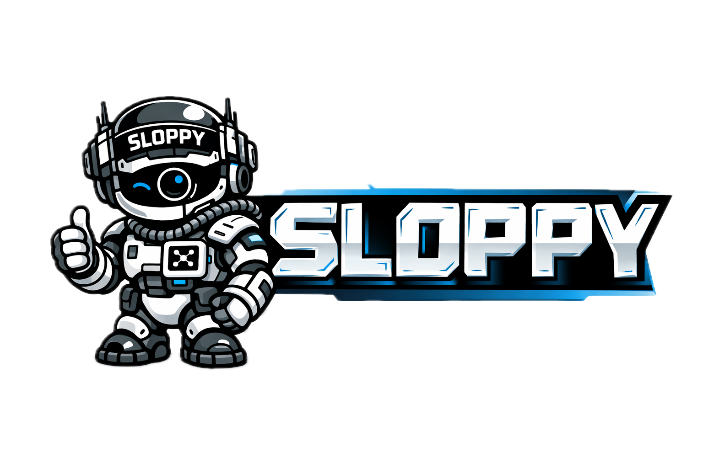

# 🤖 Sloppy - AI Agents that increase your vibe

<p align="center">
  <picture>
    
  </picture>
</p>

> Did you catch your Sloppie?

[](https://deepwiki.com/TeamSloppy/Sloppy)
[](https://github.com/TeamSloppy/Sloppy/blob/main/LICENSE)
[](https://swiftpackageindex.com/TeamSloppy/Sloppy)
[](https://swiftpackageindex.com/TeamSloppy/Sloppy)

Sloppy is a multi-agent runtime for building operator-visible AI workflows in Swift 6 on macOS and Linux. It combines a rule-based orchestration core, branch and worker execution, persistent runtime state, model/provider plugins, channel integrations, and a React dashboard for observing what the system is doing.

## 🎯 Sloppy is right for you if

✅ You vibe-code and want AI agents that handle the boring stuff while you focus on ideas

✅ You want personal master agents — like a team of experts that execute anything you ask

✅ You automate repetitive workflows and need agents that run reliably, not just once

✅ You orchestrate multiple AI agents (Claude, Codex, Cursor, OpenClaw) and need one place to see what everyone is doing

✅ You want agents running autonomously 24/7, but still want to audit, steer, and chime in when needed

✅ You want native macOS & iOS apps, a web dashboard, plus Telegram & Discord — all talking to the same runtime

✅ You want to manage your autonomous workflows from your phone

## 💡 What Is Sloppy

Sloppy is a control plane for AI agents and tool-driven workflows.

At its core, the project provides:

| Component | Purpose |
| --- | --- |
| `sloppy` | 🖥️ HTTP API, routing layer, orchestration services, persistence, scheduling, and plugin bootstrap |
| `AgentRuntime` | 🧠 Runtime model built around `Channel`, `Branch`, `Worker`, `Compactor`, and `Visor` |
| `PluginSDK` | 🔌 Extension points for model providers, tools, memory, and gateways |
| `Node` | ⚙️ Daemon for process execution |
| `Dashboard` | 📊 Vite/React UI for runtime visibility |

The runtime is designed to keep agent execution structured, inspectable, and recoverable instead of collapsing everything into one opaque prompt loop.

## ✨ Features

| Feature | What it provides |
| --- | --- |
| 🔀 Channel / Branch / Worker runtime | Separates user interaction, focused work, and execution flows |
| 📐 Rule-based routing | Makes route decisions deterministic and inspectable |
| 🏗️ Worker modes | Supports both interactive and fire-and-forget workers |
| 📦 Compaction | Triggers summarization on context thresholds |
| 👁️ Visor bulletins | Produces periodic memory digests for operators |
| 💾 SQLite persistence | Stores channels, tasks, events, artifacts, and bulletins |
| 🔌 Plugin system | Extends models, tools, memory, and gateways without hard-coding providers |
| 🤖 `AnyLanguageModel` bridge | Connects providers such as OpenAI and Ollama |
| 💬 Telegram gateway | Bridges Telegram chats into Sloppy channels |
| 📊 Dashboard | Exposes chat, activity, artifacts, and runtime state in the UI |

## 🧩 Problems Sloppy Solves

Sloppy is built for teams that need more structure than a single-agent chatbot can provide.

| Problem | How Sloppy addresses it |
| --- | --- |
| 🔍 Agent behavior is too opaque | Turns execution into explicit runtime entities and lifecycle events |
| ⏳ Long-running flows are hard to understand | Persists state, artifacts, and event logs |
| 📈 Context grows too quickly | Splits work into branches and workers and returns concise outputs |
| 💰 Token costs drift upward | Uses compaction and short structured payloads |
| 🧶 Integrations become fragmented | Unifies channels, tools, memory, and model providers behind one runtime |
| 🙈 Operators lack visibility | Exposes the system through an API and dashboard instead of raw prompt debugging |

## 🏆 Why We Are Different

What makes Sloppy distinct in its current form:

- 🦅 **Swift-first runtime** — the orchestration layer, persistence, HTTP transport, and executables live in a single Swift package.
- 🎯 **Deterministic routing before autonomy** — routing is policy-driven and inspectable, not hidden inside a monolithic LLM prompt.
- 👁️ **Runtime visibility as a product feature** — channels, workers, events, artifacts, and bulletins are first-class concepts.
- 🔌 **Plugin boundaries instead of hard-coded providers** — models, gateways, tools, and memory can evolve independently.
- 🏠 **Local-first development path** — you can run the core, SQLite persistence, dashboard, and local model integrations without building a large distributed system first.

## 🚀 Quick Start

```bash
git clone https://github.com/TeamSloppy/Sloppy.git
cd Sloppy
bash scripts/install.sh
sloppy run
```

By default the installer builds the server stack and bundled dashboard assets. To skip the dashboard build, run:

```bash
bash scripts/install.sh --server-only
```

Default local endpoints after `sloppy run`:

- API: `http://localhost:25101`
- Dashboard: `http://localhost:25102`

Remote bootstrap variants:

```bash
curl -fsSL https://sloppy.team/install.sh | bash
curl -fsSL https://sloppy.team/install.sh | bash -s -- --server-only
```

📖 For detailed install options, Docker, and configuration, see [docs/install.md](docs/install.md) and [docs/index.md](docs/index.md).

## ❓ FAQ

### Do I need an API key to run Sloppy?

No. The runtime, tests, and dashboard can run without OpenAI credentials. You only need provider-specific credentials when you want to use those providers.

### Which channels are supported?

The repository currently ships built-in Telegram and Discord channel plugins. The HTTP API is also a first-class entry point, and additional gateways can be added through the plugin system.

### Does Sloppy support MCP and ACP?

Yes. Sloppy can connect to external MCP servers and expose their tools/resources to agents, and it can delegate agent execution to external ACP-compatible coding agents.

### Where does Sloppy store data?

The default runtime uses SQLite for persistence. Workspace data, logs, artifacts, and related runtime files are created under the configured workspace root.

### Does Sloppy have observability tooling built in?

Yes. The dashboard, persisted events, artifact tracking, and Visor bulletins are all part of the current product surface, not future roadmap items.

### Is there a native app?

Yes. The repository includes an Apple client workspace in `Apps/Client`. It is currently an internal-first native client, built separately from the root server package.

### Does Sloppy support Linux?

Yes. Linux is part of the active build and release matrix in CI. For direct terminal builds on Ubuntu or Debian-based systems, install `libsqlite3-dev` before running Swift commands.

### Where can I read more about the architecture?

Learn more about Sloppy in [DeepWiki](https://deepwiki.com/TeamSloppy/Sloppy)

## 🤝 Contributing

Contributions should stay aligned with the current architecture, validation steps, and repository rules.

📖 Start here: [install](https://docs.sloppy.team/install) and [development workflow](https://docs.sloppy.team/guides/development-workflow)

## ⭐ Star History

[](https://www.star-history.com/?repos=teamsloppy%2Fsloppy&type=date&legend=top-left)

## 📄 License

Sloppy is released under the MIT License. See [LICENSE](LICENSE).
