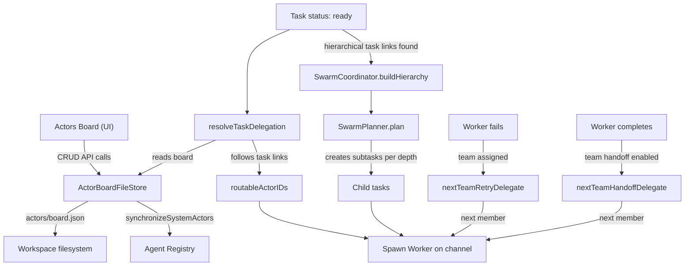

# Actors Board: Architecture of Task Delegation in Sloppy

## What is the Actors Board

The Actors Board (`ActorsView.tsx`) is a visual graph editor that defines **who can do what** in the Sloppy workspace. It is the central configuration surface that controls how tasks are routed, delegated, and executed. Without an actor graph, the runtime has no routing information and tasks cannot be automatically assigned.

The board consists of three entity types:

- **Nodes** (Actors) — participants that can receive and execute tasks
- **Links** — directed connections between actors that define communication routes
- **Teams** — named groups of actors that enable round-robin delegation and retry logic

The board is persisted as a JSON file at `actors/board.json` in the workspace root (see `ActorBoardFileStore`).

---

## Actor Nodes

Each actor node has the following key properties:

| Property        | Purpose                                                                                  |
|-----------------|------------------------------------------------------------------------------------------|
| `id`            | Unique identifier. System actors use `human:admin` or `agent:<agentId>` prefixes.        |
| `kind`          | One of `agent`, `human`, or `action`.                                                    |
| `role`          | Free-text description of what this actor does (e.g. "Backend developer", "QA engineer"). |
| `linkedAgentId` | For `agent` kind — binds the node to a registered AI agent.                              |
| `channelId`     | The channel where this actor executes work.                                              |
| `systemRole`    | Structured role: `manager`, `developer`, `qa`, `reviewer`, `custom`.                     |

### Actor Kinds

**`agent`** — an AI agent registered in the system. Created automatically when you register an agent. The node's `linkedAgentId` references the agent record; its `channelId` is the agent's dedicated execution channel.

**`human`** — a human participant. Used to represent operators, stakeholders, or external people in the workflow graph. The built-in `human:admin` actor represents the workspace administrator.

**`action`** — an automation or integration endpoint. Used to model non-agent automated steps that participate in routing.

### System Actors

Two categories of actors are managed automatically by the runtime and cannot be deleted from the board:

1. **`human:admin`** — always present, represents the workspace administrator. Its `systemRole` is `manager`. Position on the canvas can be changed, but identity and role are immutable.
2. **`agent:*`** — one node per registered AI agent, synchronized automatically from the agents registry on every board load. Their `role` field is taken directly from `AgentSummary.role`. When an agent is deleted from the registry, its board node is removed too.

User-created actors (kind `human` or `action`) can be freely added and removed.

### Why Roles Matter

The `role` field on an actor node serves two distinct purposes:

**1. LLM behavior context**

When a task is delegated to an agent actor, the agent's `role` string is included in the execution context sent to the language model. This tells the model what domain the agent specializes in — "You are a senior backend developer", "You are a QA engineer focused on regression testing". The role directly shapes the agent's output quality and focus area for that task.

This is why roles should be descriptive and specific. A role like "developer" is weaker than "Backend developer specializing in Swift and database performance". The latter produces more targeted and useful agent output.

**2. Structured system role for review automation**

The `systemRole` enum (`manager`, `developer`, `qa`, `reviewer`, `custom`) is used by the review pipeline separately from the free-text `role`. When a project is configured with `approvalMode: "agent_approve"`, the system locates the actor in the task's team that carries `systemRole == .reviewer` and delegates review work to it. Without an actor carrying the `reviewer` system role in the team, automated code review cannot be triggered.

---

## Actor Links

Links are the routing backbone of the board. A link connects two actor nodes and carries four configurable properties:

| Property                        | Values                                  | Effect                                                       |
|---------------------------------|-----------------------------------------|--------------------------------------------------------------|
| `direction`                     | `one_way`, `two_way`                    | Whether messages/tasks flow in one or both directions.       |
| `relationship`                  | `hierarchical`, `peer`                  | Determines whether the link participates in swarm hierarchy. |
| `communicationType`             | `chat`, `task`, `event`, `discussion`   | Filters which links are used for which interaction type.     |
| `sourceSocket` / `targetSocket` | `top`, `right`, `bottom`, `left`        | Visual attachment points that also infer relationship type.  |

### Socket Convention and Relationship Inference

The socket position on each node is not only cosmetic — it infers the `relationship` automatically when the link is created:

- Connecting **bottom → top** (or top → bottom): inferred as `hierarchical`
- Connecting **left → right** (or any lateral pair): inferred as `peer`

This convention is reflected in the UI hints: "Top/Bottom → Hierarchical", "Left/Right → Peer". The relationship can be overridden manually via the link context menu after creation.

### How Links Drive Task Routing

When a task reaches `ready` status, the runtime calls `resolveTaskDelegation` in `CoreService`. The algorithm proceeds as follows:

1. Read the task's `actorId` and `teamId` fields to identify **preferred actors** (explicit assignments)
2. Identify the task's source channel and find all actor nodes whose `channelId` matches it
3. Traverse all outgoing `task`-type links from those actors to build the **routable actor ID set**
4. For each preferred actor (in priority order), check if it is in the routable set — if yes, delegate there
5. If no preferred actors match, delegate to the first actor in the routable set (sorted deterministically)
6. If no `task` links exist at all, fall back to allowing any actor with a valid channel

The critical implication: **as soon as you create even one `task`-type link, the board becomes the authoritative source for task routing**. Actors not reachable via `task` links from the source channel will not receive delegated tasks, even if they are registered agents.

### Relationship Types and Swarm Mode

**Peer links** — represent equal-level collaboration. Tasks and messages can flow laterally between peers. Two-way peer links allow bidirectional communication. No hierarchy is implied and no task decomposition occurs.

**Hierarchical links** — represent a manager → subordinate relationship. These are the trigger for **Swarm mode**, the system's automatic task decomposition engine.

When a task is assigned to an actor that has outgoing hierarchical `task` links, the runtime automatically decomposes the task into subtasks distributed across the actor hierarchy. Subtasks at the same depth execute in parallel; deeper levels wait for shallower ones to complete.

For the full explanation of how Swarm works — including link conditions, the planning phase, execution model, failure escalation, and dashboard visualization — see the dedicated article: [Swarm: Parallel Task Decomposition](/architecture/swarm).

---

## Teams

A team is a named, ordered group of actor node IDs (`memberActorIds`). Teams are visible on the canvas as colored bounding boxes drawn around their member nodes. Teams unlock several runtime behaviors that are not available to individually assigned actors.

### 1. Task Scoping

When a task has a `teamId` set, only members of that team are eligible to claim and execute it. This lets you partition work by domain — "Delivery Team" handles product feature tasks, "Ops Team" handles infrastructure tasks, without tasks leaking across boundaries.

### 2. Failover / Automatic Retry

When an agent worker fails while executing a task, the runtime calls `nextTeamRetryDelegate`, which walks forward through the team's member list from the current actor's position:

```
Team members: [agent:alice, agent:bob, agent:carol]

agent:alice fails  →  retry with agent:bob
agent:bob fails    →  retry with agent:carol
agent:carol fails  →  escalate (no more members)
```

The failed task's status is reset to `ready` and `claimedActorId` is updated to the next member. This retry is automatic and requires no operator intervention. Without a team, a single agent failure terminates the task with an error.

### 3. Sequential Handoff

`nextTeamHandoffDelegate` operates similarly but is called on task completion rather than failure. When a completed task's workflow requires review or a follow-on phase, the work is passed to the next team member in sequence. This supports multi-stage pipelines:

```
agent:developer completes  →  handoff to agent:reviewer
agent:reviewer completes   →  handoff to agent:qa
```

### 4. Project Association

In Project Settings (Actors tab), you associate specific actors and teams with a project. This controls which actors are eligible to interact with a project's tasks and channels. An actor or team not associated with a project is ignored by the routing engine for tasks belonging to that project.

---

## Visual Board Interaction

The `ActorsView.tsx` component provides a fully interactive canvas:

- **Pan and zoom** — scroll to pan, Shift+scroll or Ctrl+scroll to zoom. The canvas is infinite.
- **Node drag** — click and drag any node to reposition it. Positions are saved automatically on pointer release.
- **Socket-based linking** — hover a node to reveal its four sockets (top, right, bottom, left). Drag from any socket to another node's socket to create a link. The target socket determines the inferred relationship.
- **Link context menu** — click any link to open a floating menu. Toggle direction (one-way / two-way) and relationship (hierarchical / peer) inline. Changes are auto-saved.
- **Node properties panel** — click a node to open its properties panel (appears to the right). Edit display name and role. Agent and admin nodes are immutable except for position.
- **Team management** — open the "New Team" popup to create or edit teams. Use the searchable dropdown to add members. Teams are displayed as colored, draggable group boundaries on the canvas.
- **Team group drag** — drag the team bounding box (not an individual node) to move all team members together as a unit.
- **Route preview** — select an actor and click the preview button to resolve which actors it can reach for the currently selected communication type.

---

## Data Flow



---

## Practical Setup Guide

### Minimum viable setup

1. Register at least one AI agent — an `agent:*` node appears on the board automatically
2. Create a `task`-type, one-way link from `human:admin` to the agent (drag bottom socket of admin to top socket of agent, or lateral sockets for a peer link)
3. In Project Settings → Actors, associate the agent actor with the project
4. Tasks in that project with status `ready` will now route to the agent automatically

### When to create a team

- You have 2+ agents working in the same domain and want automatic failover if one fails
- You need a sequential handoff pipeline (developer → reviewer → QA)
- You want to scope a category of tasks to a specific subset of actors rather than the whole board
- You use `agent_approve` review mode — the reviewer actor must be a team member with `systemRole: reviewer`

### When to use hierarchical links

- You have a root actor (e.g. `human:admin` or a lead agent) and want large tasks automatically broken into subtasks
- You have agents at different specialization levels: architect → implementation agents → test agents
- You want depth-based parallel execution with dependency ordering between levels

Do not use hierarchical links for simple peer workflows — they trigger the full swarm decomposition pipeline which involves an LLM planning call and multiple child tasks.

See [Swarm: Parallel Task Decomposition](/architecture/swarm) for a step-by-step setup guide and full description of swarm execution behavior.

### How to write effective roles

- Always set the `role` field on agent actors. An empty role gives the LLM no domain context.
- Be specific and action-oriented: "Senior iOS developer specializing in SwiftUI and Core Data" is better than "iOS developer".
- Match the role to the tasks the agent will actually receive. A mismatch between role and task type produces lower-quality output.
- For the review pipeline, ensure exactly one actor per team carries `systemRole: reviewer`. Multiple reviewer actors in the same team are not supported by the current routing logic.
