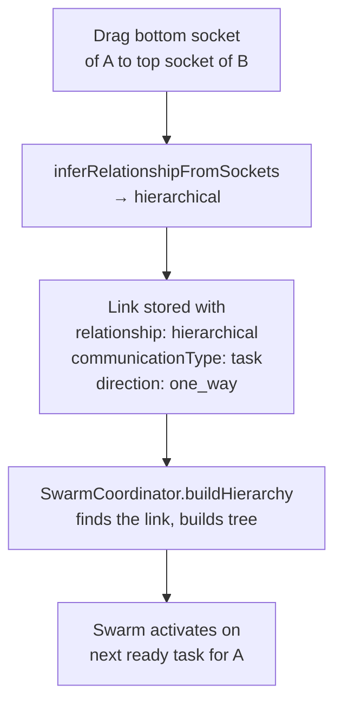

# Swarm: Parallel Task Decomposition

## What is Swarm and why it exists

Most tasks are straightforward enough to assign to a single agent. But some tasks are large, multi-domain, or naturally parallel — refactoring a service across backend and frontend, building a feature end-to-end from design to tests, running a migration with parallel validation steps.

Without Swarm, the operator must manually break these tasks into subtasks, assign each one, and coordinate sequencing. Swarm eliminates that overhead.

When a task is assigned to an actor that has **hierarchical task links** to subordinate actors, the runtime activates Swarm mode automatically:

1. An LLM (`SwarmPlanner`) reads the parent task description and the actor hierarchy
2. It decomposes the task into subtasks mapped to each level of the hierarchy
3. Subtasks at the same depth execute in parallel
4. Each depth level waits for the previous one to complete before starting
5. When all subtasks finish, the root task is marked as done

The operator creates one task. The runtime handles planning, distribution, execution, and failure escalation.

---

## How Swarm is triggered

Swarm is driven entirely by the shape of the Actors Board. No configuration flag or special task field is needed. The trigger is the presence of hierarchical one-way task links from the root actor.

### The three conditions

`SwarmCoordinator.buildHierarchy` scans all actor links and only considers a link as part of the hierarchy when **all three** conditions are met simultaneously:

| Condition | Required value | Why |
|---|---|---|
| `communicationType` | `task` | Only task-type links route delegation. Chat, event, and discussion links are not part of execution routing. |
| `relationship` | `hierarchical` | Peer links model equal-level collaboration. Only hierarchical links imply a manager → subordinate structure. |
| `direction` | `one_way` | Two-way hierarchical task links are ambiguous — the system cannot determine which end is the manager. They are logged and skipped. |

If the root actor has no links matching all three conditions, `buildHierarchy` returns `.noHierarchy` and the task is delegated normally to a single actor.

If cycles are detected in the hierarchy, `buildHierarchy` returns `.cycle` and the task is immediately escalated to a human actor rather than entering an infinite delegation loop.

### From UI sockets to relationship type

The socket position you use when drawing a link in the Actors Board directly infers the `relationship` field:

```
Bottom socket → Top socket     =  hierarchical
Top socket → Bottom socket     =  hierarchical
Left socket → Right socket     =  peer
Right socket → Left socket     =  peer
Any other combination          =  peer
```

This is enforced by `inferRelationshipFromSockets` in `ActorsView.tsx`. The inferred value is stored alongside the link and can be overridden manually in the link context menu after creation. When no explicit relationship is stored, `SwarmCoordinator` re-applies the same socket inference at execution time via `effectiveRelationship`.



---

## How to create a Swarm setup

### Step 1 — Register agents

Register at least two AI agents. Each registered agent automatically gets an `agent:*` node on the Actors Board. Their roles (set in Agent Settings) are included in the context the LLM uses during subtask planning, so specific and descriptive roles produce better plans.

### Step 2 — Draw hierarchical task links

Open the **Actors** section in the Dashboard.

For each agent that should be a direct subordinate of the root actor:

1. Hover the root actor node — four sockets appear (top, right, bottom, left)
2. Drag from the **bottom socket** of the root actor
3. Drop on the **top socket** of the subordinate agent

This creates a link with `relationship: hierarchical`, inferred automatically from the bottom → top socket pair. The link's `communicationType` defaults to `chat`. **Change it to `task`** using the link context menu that appears when you click the link. Set `direction` to `one_way`.

Repeat for each depth level you want. An agent at depth 1 can itself have hierarchical task links to depth-2 agents, forming a multi-level tree.

**Example hierarchy:**

```
human:admin  (root, depth 0)
├── agent:backend   (depth 1)
├── agent:frontend  (depth 1)
│   └── agent:qa    (depth 2)
```

### Step 3 — Associate actors with the project

In Project Settings → Actors tab, associate the actors you want active for this project. Actors not associated with the project are ignored by the routing engine.

### Step 4 — Create a task and set it to ready

Create a task in the project. Assign it explicitly to the root actor (e.g. `human:admin`) or to a team that includes the root actor. Set the task status to `ready`.

The runtime calls `handleTaskBecameReady`, which triggers `startSwarmIfHierarchical`. If a hierarchy is found, Swarm mode activates.

---

## How links in the Actors Board affect Swarm

### The link model

Each link between two actor nodes in the Actors Board carries four properties that are configurable from the UI:

| Property | Options | Where set in UI |
|---|---|---|
| `direction` | `one_way`, `two_way` | Link context menu → One-Way / Two-Way |
| `relationship` | `hierarchical`, `peer` | Link context menu → Hierarchical / Peer; auto-inferred from sockets |
| `communicationType` | `chat`, `task`, `event`, `discussion` | Link context menu (communicationType field) |
| `sourceSocket` / `targetSocket` | `top`, `right`, `bottom`, `left` | Determined at draw time by which socket you drag from/to |

### Link effect on Swarm

| `communicationType` | `relationship` | `direction` | Effect on Swarm |
|---|---|---|---|
| `task` | `hierarchical` | `one_way` | Included in hierarchy. Activates Swarm. |
| `task` | `hierarchical` | `two_way` | Skipped — ambiguous direction, logged as warning. |
| `task` | `peer` | any | Not included. Does not activate Swarm. Used for normal task routing. |
| `chat` / `event` / `discussion` | any | any | Not included. Never used by SwarmCoordinator. |

### Socket-based relationship inference

If a link has no explicit `relationship` value stored, both `ActorsView.tsx` at creation time and `SwarmCoordinator` at execution time derive it from the sockets:

```
sourceSocket == bottom, targetSocket == top  →  hierarchical
sourceSocket == top,    targetSocket == bottom →  hierarchical
anything else                                 →  peer
```

The UI hints on the Actors Board ("Top/Bottom → Hierarchical", "Left/Right → Peer") reflect this rule directly.

### Changing a link's behavior after creation

Click any link on the canvas to open the Link Settings menu. You can:

- Toggle **One-Way / Two-Way** — changing a hierarchical task link from one-way to two-way removes it from the swarm hierarchy
- Toggle **Hierarchical / Peer** — changing a link to peer removes it from the swarm hierarchy even if direction and communicationType still match

Changes are auto-saved immediately.

---

## Execution model

### Planning phase

When Swarm is triggered, `SwarmPlanner.plan` is called with:

- The root task's `title` and `description`
- The actor hierarchy levels: `depth 1: agent:backend, agent:frontend`, `depth 2: agent:qa`, etc.

`SwarmPlanner` sends a structured prompt to the active language model (via `RuntimeSystem.complete`). The model responds with a JSON object containing an array of subtasks, each specifying:

```json
{
  "swarmTaskId": "backend-api-changes",
  "title": "Implement API changes",
  "objective": "Add the new endpoint and update the OpenAPI spec",
  "depth": 1,
  "dependencyIds": [],
  "tools": ["file", "shell"]
}
```

Constraints enforced by the planner:
- At least one subtask per depth level
- `depth` must not exceed the actual number of hierarchy levels
- `dependencyIds` must reference other subtasks in the same plan (not arbitrary strings)
- Duplicate `swarmTaskId` values are deduplicated

### Distribution phase

Once the plan is validated, `startSwarmIfHierarchical` creates child `ProjectTask` records:

- The root task gets `swarmTaskId: "root"`, `swarmDepth: 0`, status transitions to `in_progress`
- Each planned subtask becomes a new task with `status: ready`, assigned to an actor at the matching depth level
- Actors at the same depth level are assigned round-robin across all subtasks at that level
- Each subtask stores a `swarmActorPath` — the chain from root actor to assigned actor — used for failure escalation routing

### Execution phase

`executeSwarm` drives level-by-level execution:

```
depth 1 tasks → all dispatched simultaneously → wait for all to reach done
depth 2 tasks → dispatched only after depth 1 completes → wait for all to reach done
...
root task → marked done when all depths complete
```

Within a depth level, tasks whose `swarmDependencyIds` are not all in the completed set are blocked. If this happens, the swarm fails immediately rather than hanging indefinitely.

The per-level timeout is 240 seconds per batch. If tasks do not settle within this window, the swarm escalates.

### Failure and escalation

If any child task finishes with a status other than `done`, or if the per-level timeout is exceeded, `failSwarmRootWithEscalation` is called:

1. The root task is marked `blocked`
2. The failure reason is attached as a description note
3. The escalation channel is determined by walking the failed task's `swarmActorPath` in reverse, looking for the first `human` actor that has a channel. If none is found, `human:admin`'s channel is used.
4. A message explaining the failure is posted to that channel

This ensures failures surface to a human rather than silently dropping.

### Completion

When all depth levels complete successfully, `completeSwarmRoot` marks the root task as `done` and posts a summary to the execution channel, including links to any artifacts produced by child tasks.

---

## Task data model

Swarm-related fields on `ProjectTask` (`Sources/Protocols/APIModels.swift`):

| Field | Type | Description |
|---|---|---|
| `swarmId` | `String?` | Shared UUID for all tasks in a swarm execution. Nil for non-swarm tasks. |
| `swarmTaskId` | `String?` | The planner-assigned ID for this subtask (e.g. `"backend-api-changes"`). The root task uses `"root"`. |
| `swarmParentTaskId` | `String?` | The `swarmTaskId` of this task's parent in the dependency graph. |
| `swarmDependencyIds` | `[String]?` | All `swarmTaskId` values this task depends on. Must be complete before this task executes. |
| `swarmDepth` | `Int?` | Depth level in the hierarchy. Root = 0, direct subordinates = 1, etc. |
| `swarmActorPath` | `[String]?` | Ordered actor IDs from root to this task's assigned actor. Used for escalation routing. |

A task that is not part of a swarm has all these fields as nil.

---

## Dashboard: Swarm Tree view

The Projects view renders a **Swarm Tree** section above the Kanban board when any tasks in the project have a `swarmId`.

`buildSwarmGroups` in `Dashboard/src/views/Projects/utils.js` groups tasks by `swarmId`, builds a parent → children map using `swarmParentTaskId`, and returns root nodes for recursive rendering.

Each swarm is shown as a card:

- Header: `swarmId` UUID, total task count, blocked task count
- Body: recursive tree of tasks, indented by depth, showing task title, `swarmTaskId`, depth, and current status

In the Kanban columns, tasks belonging to the same swarm are grouped together with a swarm header badge, and sorted by depth within the group.

---

## Constraints and edge cases

**No hierarchy → normal delegation.** If the assigned actor has no outgoing hierarchical one-way task links, `buildHierarchy` returns `.noHierarchy` and the task is delegated to a single actor as usual.

**Cycles.** If the link graph contains a cycle (e.g. A → B → A), the swarm is immediately escalated. Cycles are detected via DFS before any planning begins.

**Empty plan.** If the LLM returns an empty subtask list or malformed JSON, the swarm fails and escalates. The planner validates the response and rejects it rather than executing a partial plan.

**Two-way hierarchical task links.** These are ignored with a warning. The hierarchy is built only from one-way links. If you need bidirectional communication between manager and subordinate, use a separate `chat`-type link alongside the one-way `task` link.

**Swarm subtasks are not re-swarmed.** A child task that itself has hierarchical task links will not trigger a nested swarm. `startSwarmIfHierarchical` checks for a non-nil `swarmTaskId` on the task and returns early, preventing nested decomposition.
