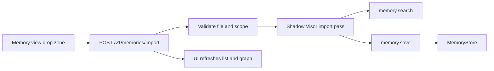

# Dashboard Memory Design

Date: 2026-06-24

## Summary

Add a top-level Dashboard Memory section that lets the user browse all memory records written by agents, switch between list and graph views, and import text files into memory through Visor. The same import mechanism is reused by global, project, and agent memory tabs; the selected tab determines the target memory scope.

## Goals

- Show a new `Memory` item in the Dashboard sidebar.
- Let the user browse all memory entries, not only entries for one agent or project.
- Reuse the existing memory list and graph experience from agent and project memory tabs.
- Let the user drag and drop a text file onto any memory view.
- Use Visor and Visor settings to transform dropped text into selected high-signal memory entries.
- Keep scope explicit:
  - top-level Memory tab writes global shared memory;
  - project memory tab writes project-scoped memory;
  - agent memory tab writes agent-scoped memory.
- Avoid duplicate facts, secrets, credentials, low-confidence guesses, and transient task status.

## Non-Goals

- Import binary documents, images, PDFs, archives, or rich office documents.
- Build a full memory editing suite for project/global memory in the first pass.
- Replace existing agent or project memory routes.
- Infer control flow from natural-language model output.

## Current State

The backend already exposes memory list and graph APIs for agent and project scopes:

- `GET /v1/agents/:agentId/memories`
- `GET /v1/agents/:agentId/memories/graph`
- `GET /v1/projects/:projectId/memories`
- `GET /v1/projects/:projectId/memories/graph`

The Dashboard already has two memory surfaces:

- `Dashboard/src/features/agents/components/AgentMemoriesTab.tsx`
- `Dashboard/src/views/Projects/ProjectMemoryTab.tsx`

Both render paginated cards and a `vis-network` graph, with duplicated normalization, graph settings, and rendering code. The Dashboard route model has no top-level `memory` section today.

The memory tool layer already has `memory.search` and `memory.save`. `memory.save` requires an explicit scope and rejects calls without one. The memory checkpoint system already runs an internal model pass with a restricted tool allowlist.

## Proposed UX

Add `Memory` to the main sidebar with route `/memory`.

The top-level view contains:

- search input;
- scope/class/kind/category filters;
- list/graph segmented control;
- paginated memory cards;
- details inspector for the selected memory;
- drop zone that appears on drag-over and a normal import button for keyboard users.

The view should feel like an operational dashboard surface, not a marketing page. It should be dense enough for scanning, with stable card sizes, restrained colors, and responsive layout.

The same drop zone pattern is added to:

- top-level Memory view;
- `ProjectMemoryTab`;
- `AgentMemoriesTab`.

After a successful import, the active list and graph refresh automatically. The UI reports how many memories were created, skipped as duplicates, or rejected by safety rules.

## Scope Rules

The import UI passes a typed scope to the backend:

| Surface | Scope |
| --- | --- |
| Top-level Memory | `{ "type": "global", "id": "shared" }` |
| ProjectMemoryTab | `{ "type": "project", "id": projectId, "projectId": projectId }` |
| AgentMemoriesTab | `{ "type": "agent", "id": agentId, "agentId": agentId }` |

The backend validates the scope and rejects mismatches. For project and agent scopes, the referenced project or agent must exist.

## Backend API

Add general memory APIs:

- `GET /v1/memories`
- `GET /v1/memories/graph`
- `POST /v1/memories/import`

`GET /v1/memories` accepts:

- `search`
- `filter`
- `scopeType`
- `scopeId`
- `kind`
- `class`
- `limit`
- `offset`

`GET /v1/memories/graph` accepts the same search and filter inputs, excluding pagination.

`POST /v1/memories/import` request:

```json
{
  "filename": "notes.txt",
  "content": "text file contents",
  "scope": {
    "type": "global",
    "id": "shared"
  }
}
```

Response:

```json
{
  "ok": true,
  "scope": {
    "type": "global",
    "id": "shared"
  },
  "created": [
    {
      "id": "memory-id",
      "note": "Saved fact",
      "summary": "Saved fact",
      "kind": "fact",
      "memoryClass": "semantic"
    }
  ],
  "skipped": [
    {
      "reason": "duplicate",
      "summary": "Existing related memory found"
    }
  ],
  "message": "Imported 3 memories; skipped 2."
}
```

The exact response can reuse existing `AgentMemoryItem` for created rows to keep the UI simple.

## Visor Import Flow

The import endpoint runs a shadow Visor operation rather than a visible chat message.

Model selection:

1. `currentConfig.visor.autodream.model`
2. `currentConfig.visor.model`
3. normal system default model

Allowed tools:

- `visor.status`
- `memory.search`
- `memory.save`

The bootstrap prompt includes:

- filename;
- content, truncated to a fixed safe character limit;
- target scope;
- rules for durable memory;
- instruction to call `memory.search` before each `memory.save`;
- instruction to save at most a bounded number of high-confidence entries;
- instruction not to save secrets, credentials, tokens, private URLs, speculative guesses, transient status, or duplicates.

The backend records tool results from `memory.save` and returns the saved memory IDs. The response must be based on tool call records, not natural-language model text.

## Data Flow



## Frontend Components

Create shared memory UI modules under `Dashboard/src/features/memory/`:

- `MemoryView.tsx` for the top-level section.
- `MemoryBrowser.tsx` for list/graph shared layout.
- `MemoryGraph.tsx` for `vis-network` rendering and settings.
- `MemoryImportDropzone.tsx` for drag and drop plus file picker.
- `memoryModel.ts` for normalization and filter types.

Then refactor agent and project memory tabs to use the shared browser and import drop zone while keeping their route-specific wrappers.

Routing changes:

- Add `memory` to `TOP_LEVEL_SECTIONS`.
- Add a sidebar item with Material Symbols icon `psychology` or `memory`.
- Render `MemoryView` in `DashboardShell`.

API client changes:

- Add `fetchMemories`.
- Add `fetchMemoryGraph`.
- Add `importMemoryFile`.
- Re-export them from `Dashboard/src/api.ts`.

## Error Handling

- Reject empty files.
- Reject files over a bounded size in both UI and backend.
- Accept only text-like files in the UI; backend still validates content length and UTF-8 text.
- Show readable UI errors for unsupported type, oversized file, invalid scope, model failure, or no memories selected by Visor.
- If the Visor operation succeeds but creates no entries, report that nothing durable was found.
- If one memory save fails, keep successful saves and include failure details in the response.

## Testing

Backend:

- `GET /v1/memories` lists global/project/agent entries with filters and pagination.
- `GET /v1/memories/graph` returns seed nodes, linked neighbors, edges, and truncation state.
- `POST /v1/memories/import` validates scope and file content.
- Import uses Visor model fallback from `autodream.model` to `visor.model` to default.
- Import response is derived from `memory.save` tool results.
- Project and agent import scopes reject unknown IDs.

Frontend:

- Route parser/build path handles `/memory`.
- API client builds query strings correctly.
- Drop zone rejects non-text and oversized files before upload.
- Top-level Memory uses global shared scope.
- Project and agent tabs pass their own scopes into the shared importer.

Verification:

- `swift test --filter Memory`
- relevant narrow router tests
- `cd Dashboard && npm run typecheck`
- `cd Dashboard && npm run build`

## Open Implementation Notes

- The first implementation can preserve agent/project edit and delete behavior as agent-only if existing backend routes only support agent memory mutations.
- If global/project editing is later needed, add general update/delete memory routes after the browsing and import path is stable.
- The existing agent/project memory components contain useful rendering logic but should be carefully extracted to avoid changing behavior while adding the global view.
